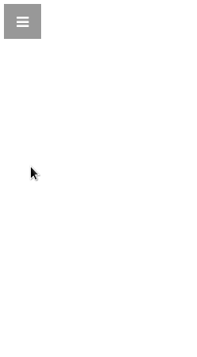

# Impromptu React Side Menu

A side menu component for React. 

### What does it look like?



[Here](http://johanneshilden.github.io/impromptu-react-sidemenu) is an example. 

## Installation

Npm is the recommended install method.

```bash
$ npm install impromptu-react-sidemenu
```

After installing, copy the public assets to your project folder to get access to the required stylesheets and fonts. 

```bash
$ cp -r node_modules/impromptu-react-sidemenu/public/ .
```
Include the CSS file with e.g., `<link href="public/css/impromptu.css" rel="stylesheet">`.

## How to use

A menu is layed out according to the following structure.

```jsx
<Menu position='right'>
    <Brand>Title</Brand>
    <Item onClick={...}>
       A menu item
    </Item>
    <Item onClick={...}>
       Another menu item
    </Item>
    <Item onClick={...}>
       Yet another menu item
    </Item>
</Menu>
```

As an example, we could create a component in a file `main.js`.

```jsx
var React = require('react');
var Menu  = require('impromptu-react-sidemenu').Menu;
var Brand = require('impromptu-react-sidemenu').Brand;
var Item  = require('impromptu-react-sidemenu').Item;

var MenuComponent = React.createClass({
    handleClick: function(item) {
        /*
        switch (item) {
            case 0:
                // ... do stuff
            case 1:
                // ... do stuff
            ...
        }
        */
    },
    render: function() {
        return (
            <Menu>
                <Brand onClick={this.handleClick.bind(null, 0)}>
                    My menu is grandiose
                </Brand>
                <Item onClick={this.handleClick.bind(null, 1)}>
                    Item #1
                </Item>
                <Item onClick={this.handleClick.bind(null, 2)}>
                    Item #2
                </Item>
                <Item onClick={this.handleClick.bind(null, 3)}>
                    Item #3
                </Item>
            </Menu>
        );
    }
});

React.render(
    <MenuComponent />,
    document.getElementById('anchor')
);
```

Then build the component. In this example, [Browserify](http://browserify.org/) is used.

```bash
$ browserify -t reactify main.js -o bundle.js
```

In some cases, you may want to use ordinary hyperlinks inside the menu `Item`s and `Brand` element instead of the `onClick` handler.

```jsx
var MenuComponent = React.createClass({
    render: function() {
        return (
            <Menu>
                <Brand>
                    <a href="#item-1">My menu is grandiose</a>
                </Brand>
                <Item>
                    <a href="#item-1">Item #1</a>
                </Item>
                <Item>
                    <a href="#item-2">Item #2</a>
                </Item>
                <Item>
                    <a href="#item-3">Item #3</a>
                </Item>
            </Menu>
        );
    }
});
```

You may also want to have a look at the [included example](https://github.com/johanneshilden/impromptu-react-sidemenu/blob/master/js/main.js) for some different configuration options.

### HTML

A bare minimum HTML host template could look like the one below.

```html
<!DOCTYPE html>
<html lang="en">
<head>
    <meta charset="utf-8">
    <meta http-equiv="X-UA-Compatible" content="IE=edge">
    <meta name="viewport" content="width=device-width, initial-scale=1">
    <title>Impromptu React Side Menu</title>
    <link href="public/css/impromptu.css" rel="stylesheet">
</head>
<body>
    <div class="impromptu-font-sans" id="anchor"></div>
    <script src="bundle.js"></script>
</body>
</html>
```

## Props

| Property        | Type                     | Description   | Default      | 
| --------------- | ------------------------ | ------------- | ------------ |
| `width`         | Integer                  | Width of the menu, in pixels.  | 250         |
| `autoClose`     | Boolean                  | Controls whether the menu should automatically close when a menu item is clicked.      | false      |
| `position`      | 'left'&nbsp;&vert;&nbsp;'right'         | Position of the menu.     | 'right'            |
| `showDividers`  | Boolean                  | When true, this setting enables a visible line between menu items.     | false    |

## CSS

### Sass customization

To change menu colors, a number of Sass variables are set up in `sass/impromptu.scss`. You'll have to adjust these and recompile the CSS file. See [sass-lang.com](http://sass-lang.com/) if you're not familiar with Sass.

```css
/* Open button color values */
$button-open-bg           : rgba(0, 0, 0, 0.4);
$button-open-bg-active    : rgba(0, 0, 0, 0.7);
$button-open-fg           : rgb(255, 255, 255);

/* Close button color values */
$button-close-bg          : rgb(255, 255, 255);
$button-close-bg-active   : rgba(255, 255, 255, 0.7);
$button-close-fg          : rgb(51, 51, 51);

/* Menu color values */
$menu-background          : rgb(51, 51, 51);
$menu-text-base           : rgb(153, 153, 153);
$menu-text-active         : rgb(255, 255, 255);
$menu-selected-bg         : rgba(255, 255, 255, 0.2);
$menu-divider             : rgb(74, 74, 74);
```

## Contribute

Please, do! Like the old pythagorean proverb says; "Pull requests are welcome."

## License

Impromptu React Side Menu is provided under the BSD License.

#### Font Awesome

Distributed with the Font Awesome library included. [Font Awesome](http://fontawesome.io/) is created and maintained by Dave Gandy. Fonts licensed under SIL OFL 1.1. Code licensed under MIT License.
